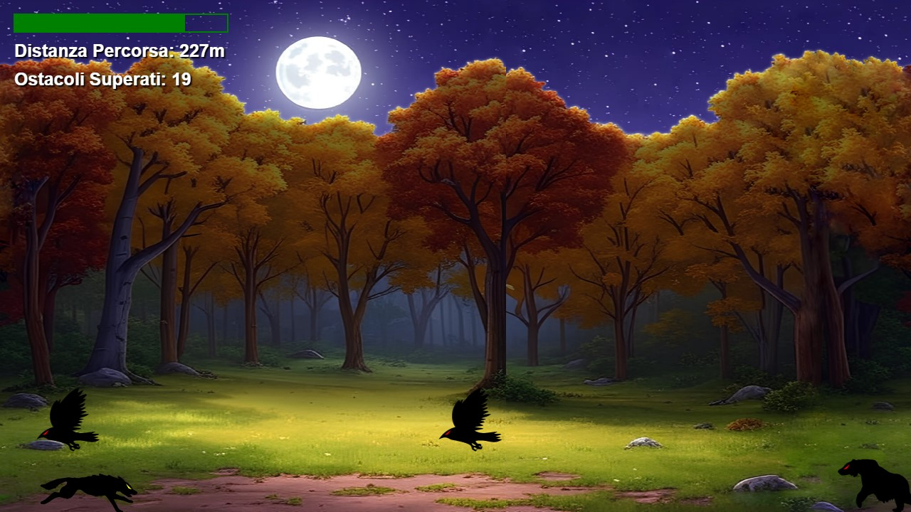

# 🌕 Nightfall Runner

Benvenuto in **Nightfall Runner**, un coinvolgente gioco 2D endless runner ambientato in un misterioso bosco autunnale sotto la luce della luna! Guida un lupo agile e scattante mentre evita pericolosi ostacoli e cerca di raggiungere il punteggio più alto.

[🎮 Gioca ora a Nightfall Runner!](https://nightfallrunner.netlify.app/)

---

## ✨ Caratteristiche principali

- 🌲 Ambientazione mistica in un bosco autunnale parallax.
- 🌌 Cielo limpido e una splendida luna piena parallax.
- 🐺 Un lupo protagonista, veloce e scattante.
- 🚧 Ostacoli impegnativi e gameplay senza fine.

---

## 🎮 Come giocare  
 
- **Controlli**:  
   1. Puoi avviare il gioco e saltare premendo spazio, freccia su oppure cliccando sullo schermo.  
   2. Al game over basterà premere l'icona del replay oppure uno dei pulsanti di gioco per riavviarlo.    
- **Obiettivo**: Ottieni il punteggio più alto ed evita più ostacoli possibili.  

---

## 🛠️ Tecnologie utilizzate  

- **HTML5**: Struttura e layout del gioco.  
- **CSS3**: Design di base.  
- **JavaScript**: Logica di gioco, caricamento e implementazione parallax/sprite, gestione degli eventi.  

---

Buon divertimento! 🌕🐺
